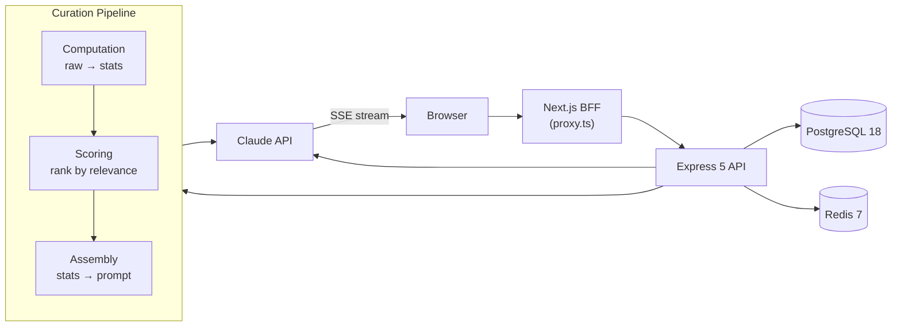

<p align="center">
  
</p>

<p align="center">
  <a href="https://github.com/coreystevensdev/tellsight/actions/workflows/ci.yml"></a>
  
  
  
  
</p>

## Overview

**Deploy:** AWS EC2 t2.micro + RDS PostgreSQL 16 + Redis 7 (Docker Compose, co-located). GitHub Actions OIDC deploys via SSM SendCommand; no SSH key stored. See [infra/README.md](infra/README.md) for the Terraform runbook.

Most analytics tools show numbers. This one explains what they mean, and delivers the interpretation to your inbox every week. Connect QuickBooks or upload a CSV (the only two data sources supported today), get charts, then a plain-English explanation of what the trends actually mean for your business. Multi-tenant Postgres with row-level security, SSE streaming for AI summaries, BullMQ three-queue digest pipeline, Stripe billing. The AI only ever sees computed statistics, never raw rows. 1,628 Vitest tests plus Playwright E2E, with the curation pipeline's financial math the most heavily covered.

## Problem

Small businesses can't afford data scientists, and enterprise analytics platforms overwhelm non-technical users with dashboards full of numbers but no guidance. The Federal Reserve's 2026 Small Business Survey puts a number on it: owners who don't feel in control of their financials are 8x more likely to report high financial stress than those who do. The gap isn't visualization. Plenty of tools make charts. The gap is interpretation: what do these numbers actually mean for my business?

## Solution

Upload a CSV or connect QuickBooks directly via OAuth (the only two supported data sources today; Shopify, Stripe, and bank-feed connectors are planned but not yet built). The dashboard instantly visualizes revenue trends, expense breakdowns, and category comparisons. Then AI reads the computed statistics (not your raw data) and explains what's happening in plain English: which costs are rising faster than revenue, where seasonal patterns suggest opportunities, what anomalies deserve attention. QuickBooks users skip the CSV export entirely. Pro users get that interpretation delivered as a weekly email digest, with week-over-week context built in, so the analysis arrives without having to remember to log in.

## Features

<p align="center">
  
</p>

<p align="center">
  
</p>

<p align="center">
  
</p>

- **Streaming AI summaries.** Claude reads the computed statistics and explains what matters. Summaries stream in real time via SSE so the user sees output as it generates.
- **Stripe billing.** Free tier with AI preview (~150 words), Pro tier for full summaries.
- **Row-level security.** Org-first multi-tenancy with PostgreSQL RLS policies on every table.
- **Shareable insights.** Generate PNG snapshots or shareable links for team collaboration.
- **Dark mode.** System preference detection + manual toggle with oklch color tokens.
- **Demo mode.** Pre-loaded seed data with cached AI summary, zero configuration needed.
- **QuickBooks integration.** Connect a QBO account via OAuth and sync directly. The same curation pipeline that reads CSVs reads QuickBooks data; same privacy guarantees apply.
- **Weekly email digest.** Pro users get a plain-English summary delivered weekly. Each digest carries prior-week context (via `digest_history`) and is tone-calibrated by a valence classifier: a positive week reads differently than a warning week, so the copy matches the underlying signal rather than always defaulting to neutral.

## Architecture



The browser never talks to Express directly. Everything routes through a Next.js BFF proxy (same-origin, no CORS). The curation pipeline computes statistics locally, scores them by relevance, then assembles a prompt from the top insights. Raw data never reaches the LLM. Only computed statistics. This privacy-by-architecture approach means the AI interprets trends and anomalies without ever seeing individual rows.

The Claude integration calls `@anthropic-ai/sdk` directly rather than going through a framework like LangChain, behind a small in-house provider seam that owns retries, a circuit breaker, a cost gate, and prompt caching. The reasoning is written up in [ADR 0001](docs/adr/0001-anthropic-sdk-over-langchain.md).

An offline eval harness grades the summaries that come out: three labeled financial fixtures (healthy-growth, cash-crunch, seasonal-anomaly) run through the full pipeline and are judged for faithfulness (no invented figures), completeness (covers the stats that matter), and legal posture (analytics framing, not financial advice). Faithfulness and completeness use LLM judges via the shared provider; legal posture is a deterministic string scanner with 24 tests in CI. Run with `pnpm eval`.

A separate agent pass runs on the same computed statistics using dedicated prompt templates, producing structured proposals with severity tiers (`info`, `notice`, `warning`, `critical`) and finding kinds (`reconciliation`, `trend`, `anomaly`, `threshold`). The `parseProposals` validator filters raw LLM output: schema-invalid proposals are dropped individually, proposals that cite stat IDs outside the allowedStatIds set are rejected, and the rest form a partial result rather than failing the whole call. A pure routing gate in `packages/shared` assigns each surviving proposal to `auto_notify`, `needs_approval`, or `suppress` based on four rules in priority order: confidence below floor suppresses; a mutating action or over-threshold financial impact routes to human approval; a dedupKey seen within the suppression window suppresses; otherwise auto-notify. Advisory posture is enforced at the contract boundary: the DIRECTIVE regex on `explanation` and `recommendation` rejects phrasing like "you should" at schema validation time rather than at content review time. This is the scaffolding for the upcoming alert UI; v1 ships informational findings only.

## Tech Stack

| Layer | Technology | Why |
|-------|-----------|-----|
| Frontend | Next.js 16, React 19.2, Tailwind CSS 4 | Turbopack for fast dev, RSC for server-rendered dashboard |
| Backend | Express 5, Node.js 22 | Auto promise rejection forwarding, mature middleware ecosystem |
| Database | PostgreSQL 18, Drizzle ORM 0.45.x | RLS for multi-tenancy, Drizzle for type-safe queries |
| Cache | Redis 7 | Rate limiting + AI summary cache |
| AI | Claude API with SSE streaming | Structured prompt engineering, streaming delivery |
| Auth | JWT + refresh rotation, Google OAuth (jose 6.x) | Secure token lifecycle, social login for onboarding |
| Monorepo | pnpm workspaces, Turborepo | Shared schemas between frontend/backend |
| Testing | Vitest, Playwright | Fast unit tests, browser-based E2E and screenshots |
| CI/CD | GitHub Actions (5-stage pipeline) | Lint, test, seed validation, E2E, Docker smoke |
| Infrastructure | AWS EC2 t2.micro, RDS PostgreSQL 16, Redis 7 (co-located container) | Free-tier eligible ($0/month for 12 months); Docker Compose on EC2 trades HA for zero infra cost |
| IaC | Terraform 1.9, GitHub OIDC (no long-lived keys) | Reproducible infra, scoped IAM roles for CI |

## Getting Started

### Prerequisites

- [Docker](https://docs.docker.com/get-docker/) and Docker Compose

### Quick Start

```bash
# 1. Clone the repo
git clone https://github.com/coreystevensdev/tellsight.git
cd tellsight

# 2. Create your env file
cp .env.example .env
# Edit .env, most defaults work for local dev
# CLAUDE_API_KEY is optional: seed data includes a pre-generated AI summary

# 3. Start the full stack
docker compose up
```

The app starts at [http://localhost:3000](http://localhost:3000) with seed data pre-loaded. The dashboard shows charts and an AI summary immediately, no account needed.

Observability stack starts alongside the app:
- Prometheus scrapes the API at `:9090`
- Grafana dashboard (HTTP latency percentiles, AI token rate, SSE streams) at `:3002` (login: admin/admin)

### Local Development

```bash
pnpm install
pnpm dev          # Start all services via Turborepo
pnpm lint         # Lint all packages
pnpm type-check   # TypeScript check
pnpm test         # Run all tests
pnpm screenshots  # Regenerate README assets via Playwright
```

## Demo

The app ships with seed data: 12 months of synthetic business data across 6 categories (Revenue, Payroll, Marketing, Rent, Supplies, Utilities) with a pre-generated AI summary. No API keys, no accounts. Just `docker compose up` and open the dashboard.

The AI summary highlights the December revenue spike, Q3 marketing dip, October payroll anomaly, and steady rent baseline. That's the kind of thing the curation pipeline surfaces from real-ish data.

## Project Structure

```
apps/web/          Next.js 16 frontend (port 3000)
apps/api/          Express 5 API (port 3001)
packages/shared/   Shared schemas, types, constants
scripts/           CI tools (seed validation, screenshot generation, AI summary eval harness)
e2e/               Playwright E2E tests
```

## Distributed systems patterns

The weekly digest pipeline illustrates several patterns that come up in high-throughput background systems.

**Three-queue BullMQ architecture.** A single shared queue with multiple worker types fails under BullMQ OSS because workers compete for jobs randomly and a processor that early-returns marks the job complete (hiding it from other workers). Three named queues (orchestrator, org, send) give independent concurrency per job type: 1 orchestrator, 3 per-org workers, 10 send workers. Independent concurrency lets the send tier scale without affecting the orchestration tier.

**Job-name idempotency.** Org jobs are named `digest-org-{orgId}-{weekStartMs}` and send jobs are named `digest-send-{userId}-{weekStartMs}`. BullMQ deduplicates by job name within a queue, so a BullMQ retry or a cron double-fire never produces duplicate sends. This is defense-in-depth alongside the DB-level cache check.

**Cache-first per-org handler.** Before invoking the curation pipeline or Claude, the per-org handler checks `aiSummariesQueries.getCachedDigest(orgId, datasetId, weekStart)`. If a summary row already exists (from a prior run, a manual trigger, or a retry), the LLM call is skipped entirely. The cost gate and the duplicate-send prevention both collapse to this single DB read.

**Exponential backoff with retry budget.** Org jobs get 3 attempts at 30s base delay; send jobs get 3 attempts at 30s base delay. Failed jobs are retained for 30 days (`removeOnFail: { age: 30 * 86_400 }`). The `attachSendFailedAnalytics` listener only fires the `digest_failed` event after all retries are exhausted, so the compliance dashboard distinguishes transient provider errors from terminal failures.

**Send-side rate limiter.** The send worker is initialized with `limiter: { max: 10, duration: 1_000 }`, capping outbound mail at 10/sec in-process. Combined with Resend's plan-tier limit and a retry-classified 429 path, this is a two-layer defense against mail provider throttling.

**Partial batch tolerance.** If enqueueing a per-org or per-send job fails (rare Redis blip), the orchestrator logs the failure with `orgId` and continues. A partial batch is better than no batch. DB errors during eligibility lookup propagate and trigger a BullMQ retry on the orchestrator job itself, because those are recoverable infrastructure failures, not acceptable partial states.

**Circuit breaker on the Claude API client.** Wraps every interpretation call in a closed/half-open/open state machine with configurable failure threshold and cooldown. Opens on consecutive failures, sends a probe on the next request after cooldown, resets on success. The state is exported to a Prometheus gauge (`circuit_breaker_state`) so Grafana can alert before users see errors.

**PostgreSQL row-level security.** Every table has RLS policies driven by session variables (`app.current_org_id`, `app.is_admin`) set via `SET LOCAL` inside a transaction. The `withRlsContext` wrapper validates orgId as a finite integer before interpolating into the `SET LOCAL` statement (safe from injection). Queries without a valid RLS context return empty results rather than throwing, so a misconfigured path fails closed.

**k6 load test SLOs.** `k6/load-test.js` enforces: p95 latency across all routes < 2s, p99 < 5s, error rate < 0.5%, health endpoint p95 < 300ms, datasets endpoint p95 < 800ms. Run locally with `k6 run k6/load-test.js` (requires a running stack and a `K6_JWT_TOKEN` env var).

## Known limitations

A few honest gaps:

- **Synthetic seed data only.** The 12 months of demo data are generated to exercise the pipeline; real CSVs with unusual category mixes or column names may surface edge cases the seed doesn't cover.
- **Curation pipeline scoring is heuristic.** The "rank by relevance" step uses hand-tuned weights, not a learned model. Fine for the demo dataset; real datasets may need re-weighting per industry.
- **Free-tier AI preview is capped at ~150 words.** Enough to evaluate quality, but a hard ceiling that Pro tier removes.
- **Two data sources today: QuickBooks OAuth and CSV upload.** There are no connectors for Shopify, Stripe, bank feeds, or other accounting platforms yet. If your data isn't already in QuickBooks, a CSV export is the only way in.

## Related project

[**InvoiceFlow**](https://github.com/coreystevensdev/invoiceflow) ([live demo](https://invoiceflow-cs.vercel.app)) applies the same privacy-first approach to extraction rather than interpretation. InvoiceFlow turns PDF invoices into structured JSON and CSV; Tellsight reads CSVs and explains what is in them. The two use the same zero-retention posture: neither persists raw financial data.

## License

MIT. See [LICENSE](LICENSE).
