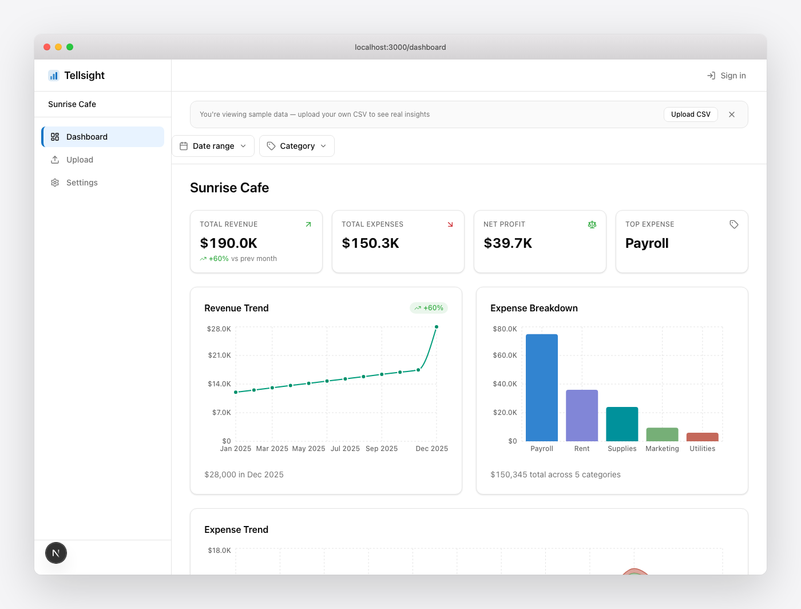
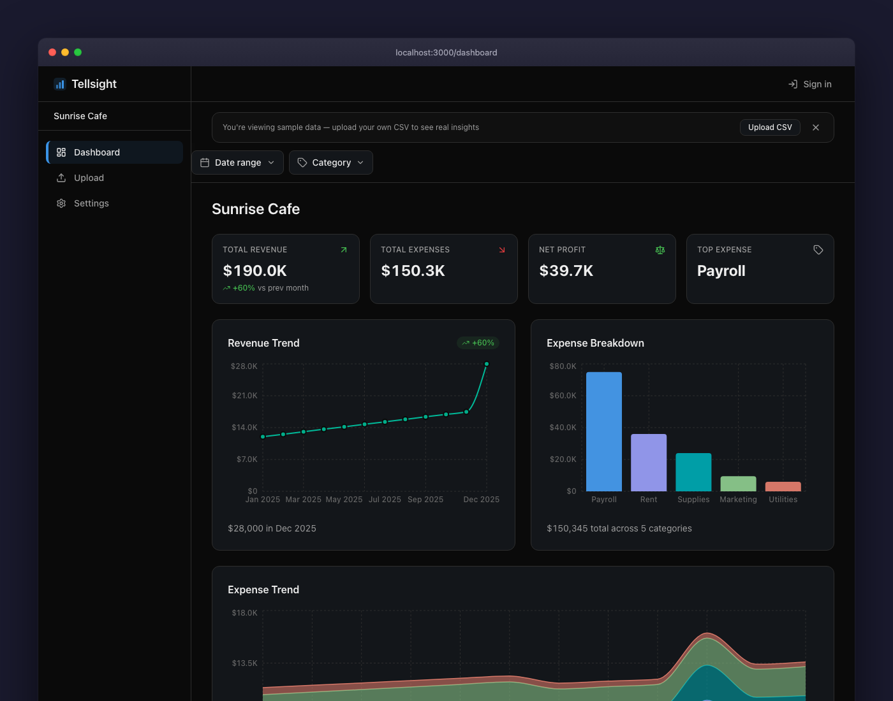
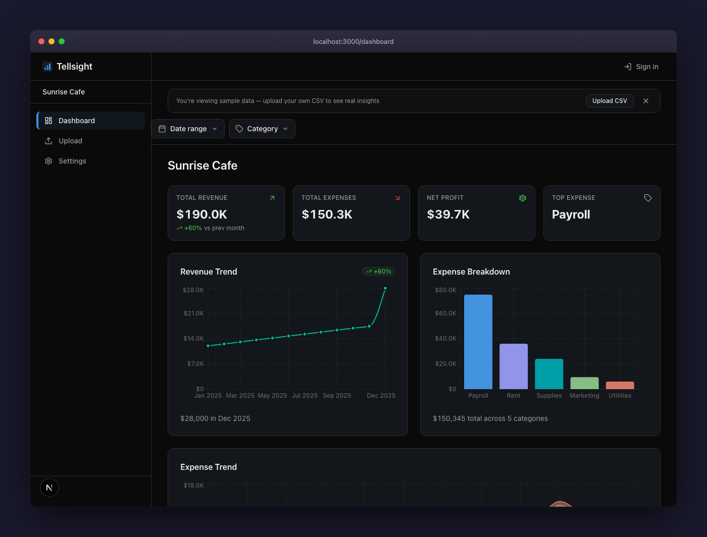
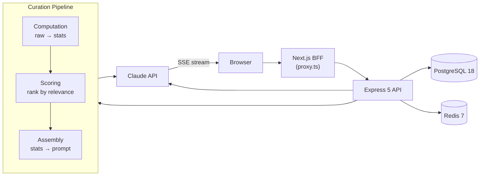

<p align="center">
  
</p>

<p align="center">
  <a href="https://github.com/coreystevensdev/tellsight/actions/workflows/ci.yml"></a>
  
  
  
</p>

## Overview

**Live demo:** [tellsight.coreystevens.dev](https://tellsight.coreystevens.dev)

Most analytics tools show numbers. This one explains what they mean, and delivers the interpretation to your inbox every week. Connect QuickBooks or upload a CSV, get charts, then a plain-English explanation of what the trends actually mean for your business. Multi-tenant Postgres with row-level security, SSE streaming for AI summaries, BullMQ-powered weekly digest, Stripe billing. The AI only ever sees computed statistics, never raw rows. 1,526 tests (Vitest + Playwright); 5-stage CI pipeline.

## Problem

Small businesses can't afford data scientists, and enterprise analytics platforms overwhelm non-technical users with dashboards full of numbers but no guidance. The Federal Reserve's 2026 Small Business Survey puts a number on it: owners who don't feel in control of their financials are 8x more likely to report high financial stress than those who do. The gap isn't visualization. Plenty of tools make charts. The gap is interpretation: what do these numbers actually mean for my business?

## Solution

Upload a CSV or connect QuickBooks directly via OAuth. The dashboard instantly visualizes revenue trends, expense breakdowns, and category comparisons. Then AI reads the computed statistics (not your raw data) and explains what's happening in plain English: which costs are rising faster than revenue, where seasonal patterns suggest opportunities, what anomalies deserve attention. QuickBooks users skip the CSV export entirely. Pro users get that interpretation delivered as a weekly email digest, with week-over-week context built in, so the analysis arrives without having to remember to log in.

## Features

<p align="center">
  
</p>

<p align="center">
  
</p>

<p align="center">
  
</p>

- **Streaming AI summaries.** Claude reads the computed statistics and explains what matters. Summaries stream in real time via SSE so the user sees output as it generates.
- **Stripe billing.** Free tier with AI preview (~150 words), Pro tier for full summaries.
- **Row-level security.** Org-first multi-tenancy with PostgreSQL RLS policies on every table.
- **Shareable insights.** Generate PNG snapshots or shareable links for team collaboration.
- **Dark mode.** System preference detection + manual toggle with oklch color tokens.
- **Demo mode.** Pre-loaded seed data with cached AI summary, zero configuration needed.
- **QuickBooks integration.** Connect a QBO account via OAuth and sync directly. The same curation pipeline that reads CSVs reads QuickBooks data; same privacy guarantees apply.
- **Weekly email digest.** Pro users get a plain-English summary delivered weekly. Each digest carries context from the prior week so the interpretation builds over time rather than repeating the same snapshot.

## Architecture



The browser never talks to Express directly. Everything routes through a Next.js BFF proxy (same-origin, no CORS). The curation pipeline computes statistics locally, scores them by relevance, then assembles a prompt from the top insights. Raw data never reaches the LLM. Only computed statistics. This privacy-by-architecture approach means the AI interprets trends and anomalies without ever seeing individual rows.

## Tech Stack

| Layer | Technology | Why |
|-------|-----------|-----|
| Frontend | Next.js 16, React 19.2, Tailwind CSS 4 | Turbopack for fast dev, RSC for server-rendered dashboard |
| Backend | Express 5, Node.js 22 | Auto promise rejection forwarding, mature middleware ecosystem |
| Database | PostgreSQL 18, Drizzle ORM 0.45.x | RLS for multi-tenancy, Drizzle for type-safe queries |
| Cache | Redis 7 | Rate limiting + AI summary cache |
| AI | Claude API with SSE streaming | Structured prompt engineering, streaming delivery |
| Auth | JWT + refresh rotation, Google OAuth (jose 6.x) | Secure token lifecycle, social login for onboarding |
| Monorepo | pnpm workspaces, Turborepo | Shared schemas between frontend/backend |
| Testing | Vitest, Playwright | Fast unit tests, browser-based E2E and screenshots |
| CI/CD | GitHub Actions (5-stage pipeline) | Lint, test, seed validation, E2E, Docker smoke |

## Getting Started

### Prerequisites

- [Docker](https://docs.docker.com/get-docker/) and Docker Compose

### Quick Start

```bash
# 1. Clone the repo
git clone https://github.com/coreystevensdev/tellsight.git
cd tellsight

# 2. Create your env file
cp .env.example .env
# Edit .env, most defaults work for local dev
# CLAUDE_API_KEY is optional: seed data includes a pre-generated AI summary

# 3. Start the full stack
docker compose up
```

The app starts at [http://localhost:3000](http://localhost:3000) with seed data pre-loaded. The dashboard shows charts and an AI summary immediately, no account needed.

### Local Development

```bash
pnpm install
pnpm dev          # Start all services via Turborepo
pnpm lint         # Lint all packages
pnpm type-check   # TypeScript check
pnpm test         # Run all tests
pnpm screenshots  # Regenerate README assets via Playwright
```

## Demo

The app ships with seed data: 12 months of synthetic business data across 6 categories (Revenue, Payroll, Marketing, Rent, Supplies, Utilities) with a pre-generated AI summary. No API keys, no accounts. Just `docker compose up` and open the dashboard.

The AI summary highlights the December revenue spike, Q3 marketing dip, October payroll anomaly, and steady rent baseline. That's the kind of thing the curation pipeline surfaces from real-ish data.

## Project Structure

```
apps/web/          Next.js 16 frontend (port 3000)
apps/api/          Express 5 API (port 3001)
packages/shared/   Shared schemas, types, constants
scripts/           CI tools (seed validation, screenshot generation)
e2e/               Playwright E2E tests
```

## Known limitations

A few honest gaps:

- **Synthetic seed data only.** The 12 months of demo data are generated to exercise the pipeline; real CSVs with unusual category mixes or column names may surface edge cases the seed doesn't cover.
- **Curation pipeline scoring is heuristic.** The "rank by relevance" step uses hand-tuned weights, not a learned model. Fine for the demo dataset; real datasets may need re-weighting per industry.
- **AI summary trust comes from Claude alone.** No second-opinion model, no rule-based validator over the output. The privacy-by-architecture stance keeps raw rows away from the LLM, but it also means there's no automated way to verify a summary against the underlying data; the user has to cross-check against the charts.
- **Free-tier AI preview is capped at ~150 words.** Enough to evaluate quality, but a hard ceiling that Pro tier removes.
- **QuickBooks is the only native connector.** Shopify, Stripe, and bank-feed integrations are planned. Until those ship, non-QBO data sources require a CSV export.

## Sister project

[**InvoiceFlow**](https://github.com/coreystevensdev/invoiceflow) ([live demo](https://invoiceflow-cs.vercel.app)) applies the same Claude + privacy-first approach to extracting data rather than interpreting it. The two compose: InvoiceFlow turns PDF invoices into CSVs; Tellsight reads CSVs and explains what's in them.

## License

MIT. See [LICENSE](LICENSE).
