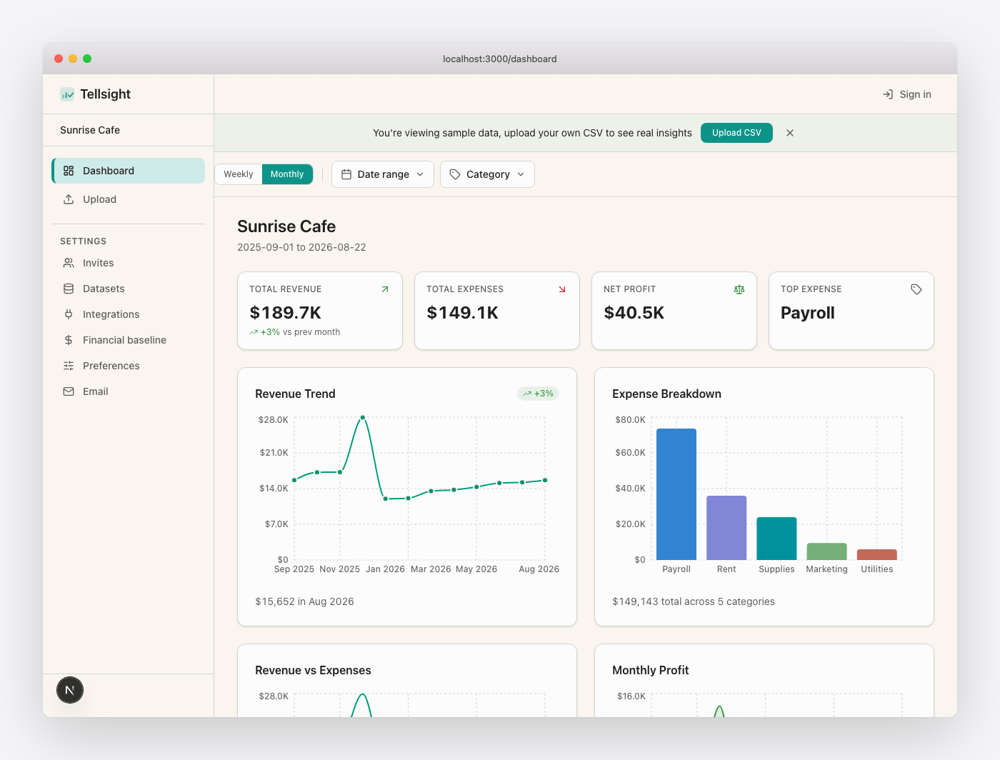
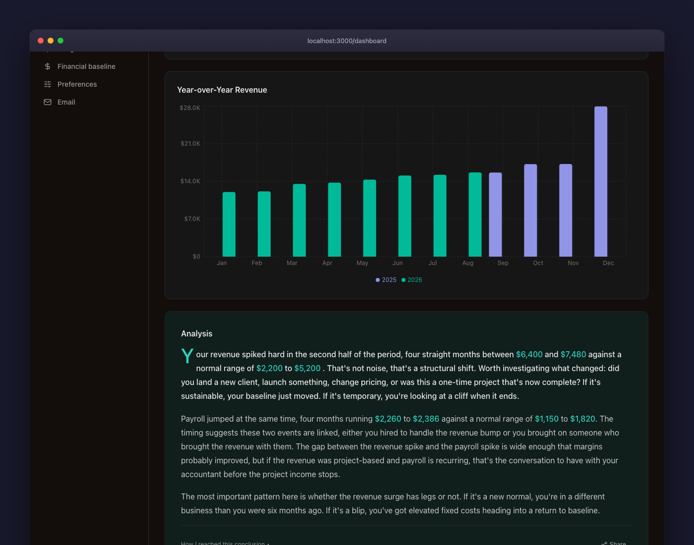
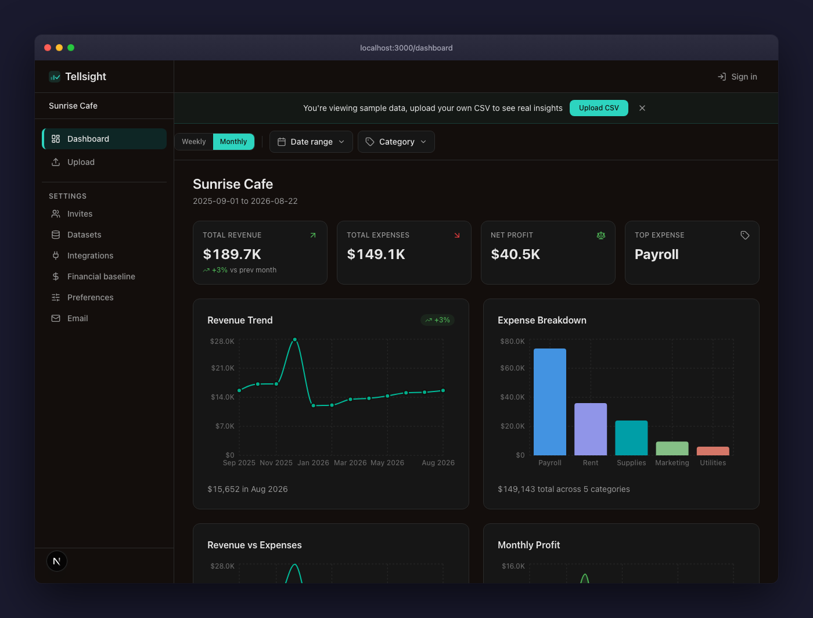
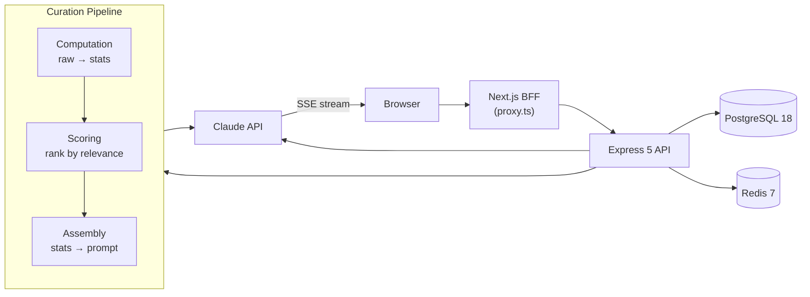

<p align="center">
  
</p>

<p align="center">
  <a href="https://tellsight.coreystevens.dev"></a>
  <a href="https://github.com/coreystevensdev/tellsight/actions/workflows/ci.yml"></a>
  
  
  
  
</p>

## Overview

**Live:** [tellsight.coreystevens.dev](https://tellsight.coreystevens.dev), no signup needed, the dashboard loads with seed data and a real AI summary. **Deploy:** AWS EC2 t3.micro + RDS PostgreSQL 18 + Redis 7 (Docker Compose, co-located). GitHub Actions OIDC deploys via SSM SendCommand; no SSH key stored. See [infra/README.md](infra/README.md) for the Terraform runbook.

Most analytics tools show numbers. This one explains what they mean, and delivers the interpretation to your inbox every week. Connect QuickBooks or upload a CSV (the only two data sources supported today), get charts, then a plain-English explanation of what the trends actually mean for your business. Sign in with Google or email and password. Multi-tenant Postgres with row-level security, SSE streaming for AI summaries, BullMQ three-queue digest pipeline, Stripe billing. The AI only ever sees computed statistics, never raw rows. 2,972 automated tests (2,965 Vitest plus 7 Playwright E2E), with the curation pipeline's financial math the most heavily covered.

## Problem

Small businesses can't afford data scientists, and enterprise analytics platforms overwhelm non-technical users with dashboards full of numbers but no guidance. The Federal Reserve's 2026 Small Business Survey puts a number on it: owners who don't feel in control of their financials are 8x more likely to report high financial stress than those who do. The gap isn't visualization. Plenty of tools make charts. The gap is interpretation: what do these numbers actually mean for my business?

## Solution

Upload a CSV or connect QuickBooks directly via OAuth (the only two supported data sources today; Shopify, Stripe, and bank-feed connectors are planned but not yet built). The dashboard instantly visualizes revenue trends, expense breakdowns, and category comparisons. Then AI reads the computed statistics (not your raw data) and explains what's happening in plain English: which costs are rising faster than revenue, where seasonal patterns suggest opportunities, what anomalies deserve attention. QuickBooks users skip the CSV export entirely. Pro users get that interpretation delivered as a weekly email digest, with week-over-week context built in, so the analysis arrives without having to remember to log in.

## Features

<p align="center">
  
</p>

<p align="center">
  
</p>

<p align="center">
  
</p>

- **Streaming AI summaries.** Claude reads the computed statistics and explains what matters. Summaries stream in real time via SSE so the user sees output as it generates.
- **Stripe billing.** Free tier with AI preview (~150 words), Pro tier for full summaries.
- **Row-level security.** Org-first multi-tenancy with PostgreSQL RLS policies on every table.
- **Shareable insights.** Generate PNG snapshots or shareable links for team collaboration.
- **Dark mode.** System preference detection + manual toggle with oklch color tokens.
- **Demo mode.** Pre-loaded seed data with cached AI summary, zero configuration needed.
- **QuickBooks integration.** Connect a QBO account via OAuth and sync directly. The same curation pipeline that reads CSVs reads QuickBooks data; same privacy guarantees apply.
- **Weekly email digest.** Pro users get a plain-English summary delivered weekly. Each digest carries prior-week context (via `digest_history`) and is tone-calibrated by a valence classifier: a positive week reads differently than a warning week, so the copy matches the underlying signal rather than always defaulting to neutral.
- **Show-me-math audit drawer.** Every AI-generated claim carries an inline `<cite id>` token; clicking it opens a drawer showing the exact computed stat and the source rows behind it, so a summary is never just a paragraph to take on faith.
- **Ask a question.** Agent-tier users can ask a direct question about their own numbers and get an interpreted answer back, cited into the same audit drawer. A bounded tool-calling loop (capped turns, capped cost) reads only computed statistics, never raw rows, and a lookup-vs-interpretation eval gates the feature against degrading into a bare-number lookup bot.

## Architecture


```mermaid
flowchart LR
    Browser --> NextJS["Next.js BFF<br/>(proxy.ts)"]
    NextJS --> Express["Express 5 API"]
    Express --> PG[(PostgreSQL 18)]
    Express --> Redis[(Redis 7)]
    Express --> Claude["Claude API"]

    subgraph Curation["Curation Pipeline"]
        direction TB
        Comp["Computation<br/>raw → stats"] --> Score["Scoring<br/>rank by relevance"]
        Score --> Assembly["Assembly<br/>stats → prompt"]
    end

    Express --> Curation
    Curation --> Claude

    Claude -- "SSE stream" --> Browser
```

The browser never talks to Express directly. Everything routes through a Next.js BFF proxy (same-origin, no CORS). The curation pipeline computes statistics locally, scores them by relevance, then assembles a prompt from the top insights. Raw data never reaches the LLM. Only computed statistics. This privacy-by-architecture approach means the AI interprets trends and anomalies without ever seeing individual rows.

The Claude integration calls `@anthropic-ai/sdk` directly rather than going through a framework like LangChain, behind a small in-house provider seam that owns retries, a circuit breaker, a cost gate, and prompt caching. The reasoning is written up in [ADR 0001](docs/adr/0001-anthropic-sdk-over-langchain.md).

An offline eval harness grades the summaries that come out: three labeled financial fixtures (healthy-growth, cash-crunch, seasonal-anomaly) run through the full pipeline and are judged for faithfulness (no invented figures), completeness (covers the stats that matter), and legal posture (analytics framing, not financial advice). Faithfulness and completeness use LLM judges via the shared provider; legal posture is a deterministic string scanner with 31 tests, run via `pnpm test:eval`, separate from CI. Run the full harness with `pnpm eval`. Last measured run (2026-08-06, 3 samples per fixture): faithfulness 0.99 aggregate, completeness 1.00 aggregate, both above their floors. Legal posture caught a real finding: one of nine samples for the cash-crunch fixture generated the literal banned phrase "you need to," a genuine occasional slip past the system prompt's instruction, not a false positive in the checker. That check is deterministic and runs offline here at QA time; the live SSE stream now runs the same check at request time too (see Known Limitations for why flagging, not blocking, is the ceiling for a streamed response). A second track, `pnpm eval:qa`, grades the Q&A tool's lookup-vs-interpretation bias with an LLM judge, backed by a deterministic numeric-figure guard covered by `interpretation-guard.test.ts` (12 tests); last measured run: 1.00 aggregate accuracy across all 8 fixtures, floor 0.85. The eval:qa track doesn't run in CI either.

A separate agent pass runs on the same computed statistics using dedicated prompt templates, producing structured proposals with severity tiers (`info`, `notice`, `warning`, `critical`) and finding kinds (`reconciliation`, `trend`, `anomaly`, `threshold`). The `validateProposalCandidate` validator filters raw LLM output: schema-invalid proposals are dropped individually, proposals that cite stat IDs outside the allowedStatIds set are rejected, and the rest form a partial result rather than failing the whole call. A pure routing gate in `packages/shared` assigns each surviving proposal to `auto_notify`, `needs_approval`, or `suppress` based on four rules in priority order: confidence below floor suppresses; a mutating action or over-threshold financial impact routes to human approval; a dedupKey seen within the suppression window suppresses; otherwise auto-notify. Advisory posture is enforced at the contract boundary: the DIRECTIVE regex on `explanation` and `recommendation` rejects phrasing like "you should" at schema validation time rather than at content review time. A nightly BullMQ job runs the pass per Agent-tier org, and `needs_approval` findings land in an in-app Action drawer where only org Owners can approve or reject; approving writes an audit row, and pending items expire after 14 days rather than accumulating into an ignorable inbox.

A third eval track, `pnpm eval:proposals`, measures the gate itself: a hand-labeled set of `AgentProposal` fixtures runs through the real `routeProposal()` with no LLM call, and precision is computed over the fixtures the gate routes to `needs_approval` (of those, what share were labeled worth a human's time). The current measured precision is 0.8 (4 of 5 needs_approval fixtures). Unlike the other two eval tracks, this one is CI-gated: the `proposal-precision-eval` job fails the build if a change drops precision below the committed snapshot baseline.

## Tech stack

| Layer | Technology | Why |
|-------|-----------|-----|
| Frontend | Next.js 16, React 19.2, Tailwind CSS 4 | Turbopack for fast dev, RSC for server-rendered dashboard |
| Backend | Express 5, Node.js 22 | Auto promise rejection forwarding, mature middleware ecosystem |
| Database | PostgreSQL 18, Drizzle ORM 0.45.x | RLS for multi-tenancy, Drizzle for type-safe queries |
| Cache | Redis 7 | Rate limiting + AI summary cache |
| AI | Claude API with SSE streaming | Structured prompt engineering, streaming delivery |
| Auth | JWT + refresh rotation, Google OAuth or email/password (jose 6.x, scrypt) | Secure token lifecycle, social login and password-based signup both onboard into the same session |
| Monorepo | pnpm workspaces, Turborepo | Shared schemas between frontend/backend |
| Testing | Vitest, Playwright | Fast unit tests, browser-based E2E and screenshots |
| CI/CD | GitHub Actions (5-stage pipeline) | Lint, test, seed validation, E2E, Docker smoke |
| Infrastructure | AWS EC2 t3.micro, RDS PostgreSQL 18, Redis 7 (co-located container) | Free-tier eligible ($0/month for 12 months); Docker Compose on EC2 trades HA for zero infra cost |
| IaC | Terraform 1.9, GitHub OIDC (no long-lived keys) | Reproducible infra, scoped IAM roles for CI |

## Getting started

### Prerequisites

- [Docker](https://docs.docker.com/get-docker/) and Docker Compose

### Quick start

```bash
# 1. Clone the repo
git clone https://github.com/coreystevensdev/tellsight.git
cd tellsight

# 2. Create your env file
cp .env.example .env
# Edit .env, most defaults work for local dev
# CLAUDE_API_KEY is optional: seed data includes a pre-generated AI summary

# 3. Start the full stack
docker compose up
```

The app starts at [http://localhost:3000](http://localhost:3000) with seed data pre-loaded. The dashboard shows charts and an AI summary immediately, no account needed.

Observability stack starts alongside the app:
- Prometheus scrapes the API at `:9090`
- Grafana dashboard (HTTP latency percentiles, AI token rate, SSE streams) at `:3002` (login: admin/admin)

### Local development

```bash
pnpm install
pnpm dev          # Start all services via Turborepo
pnpm lint         # Lint all packages
pnpm type-check   # TypeScript check
pnpm test         # Run all tests
pnpm screenshots  # Regenerate README assets via Playwright
```

### Resetting local data

```bash
bash scripts/reset-local.sh
```

Drops the Postgres and Redis volumes, rebuilds, migrates, reseeds, then checks
that `public.users` actually exists before reporting success. Use it when local
state has drifted somewhere you cannot reason about. It prompts before deleting
anything; `--yes` skips that, `--down` tears down without rebuilding.

The schema check at the end is not belt and braces. `/health/ready` runs
`SELECT 1`, which passes against a database with no tables in it at all, so a
green readiness probe is not evidence that a reset worked.

### Calling the API directly

[`docs/api.md`](docs/api.md) has curl examples for every major route, valid and
invalid, with real responses. Two things worth knowing before the first request:
there is no `/api` prefix on Express (that belongs to the Next.js proxy), and
auth is httpOnly cookies rather than a bearer header, so curl needs a cookie
jar.

## Demo

The app ships with seed data: 12 months of synthetic business data across 6 categories (Revenue, Payroll, Marketing, Rent, Supplies, Utilities) with a pre-generated AI summary. No API keys, no accounts. Just `docker compose up` and open the dashboard.

The AI summary highlights the December revenue spike, Q3 marketing dip, October payroll anomaly, and steady rent baseline. That's the kind of thing the curation pipeline surfaces from real-ish data.

## Project structure

```
apps/web/          Next.js 16 frontend (port 3000)
apps/api/          Express 5 API (port 3001)
packages/shared/   Shared schemas, types, constants
scripts/           CI tools (seed validation, screenshot generation, AI summary eval harness)
e2e/               Playwright E2E tests
```

## Distributed systems patterns

The weekly digest pipeline illustrates several patterns that come up in high-throughput background systems.

**Three-queue BullMQ architecture.** A single shared queue with multiple worker types fails under BullMQ OSS because workers compete for jobs randomly and a processor that early-returns marks the job complete (hiding it from other workers). Three named queues (orchestrator, org, send) give independent concurrency per job type: 1 orchestrator, 3 per-org workers, 10 send workers. Independent concurrency lets the send tier scale without affecting the orchestration tier.

**Job-name idempotency.** Org jobs are named `digest-org-{orgId}-{weekStartMs}` and send jobs are named `digest-send-{userId}-{weekStartMs}`. BullMQ deduplicates by job name within a queue, so a BullMQ retry or a cron double-fire never produces duplicate sends. This is defense-in-depth alongside the DB-level cache check.

**Cache-first per-org handler.** Before invoking the curation pipeline or Claude, the per-org handler checks `aiSummariesQueries.getCachedDigest(orgId, datasetId, weekStart)`. If a summary row already exists (from a prior run, a manual trigger, or a retry), the LLM call is skipped entirely. The cost gate and the duplicate-send prevention both collapse to this single DB read.

**Exponential backoff with retry budget.** Org jobs get 3 attempts at 30s base delay; send jobs get 3 attempts at 30s base delay. Failed jobs are retained for 30 days (`removeOnFail: { age: 30 * 86_400 }`). The `attachSendFailedAnalytics` listener only fires the `digest_failed` event after all retries are exhausted, so the compliance dashboard distinguishes transient provider errors from terminal failures.

**Send-side rate limiter.** The send worker is initialized with `limiter: { max: 10, duration: 1_000 }`, capping outbound mail at 10/sec in-process. Combined with Resend's plan-tier limit and a retry-classified 429 path, this is a two-layer defense against mail provider throttling.

**Partial batch tolerance.** If enqueueing a per-org or per-send job fails (rare Redis blip), the orchestrator logs the failure with `orgId` and continues. A partial batch is better than no batch. DB errors during eligibility lookup propagate and trigger a BullMQ retry on the orchestrator job itself, because those are recoverable infrastructure failures, not acceptable partial states.

**Circuit breaker on the Claude API client.** Wraps every interpretation call in a closed/half-open/open state machine with configurable failure threshold and cooldown. Opens on consecutive failures, sends a probe on the next request after cooldown, resets on success. The state is exported to a Prometheus gauge (`circuit_breaker_state`) so Grafana can alert before users see errors.

**PostgreSQL row-level security.** Every table has RLS policies driven by session variables (`app.current_org_id`, `app.is_admin`) set via `SET LOCAL` inside a transaction. The `withRlsContext` wrapper validates orgId as a finite integer before interpolating into the `SET LOCAL` statement (safe from injection). Queries without a valid RLS context return empty results rather than throwing, so a misconfigured path fails closed.

**k6 load test SLOs.** `k6/load-test.js` enforces: p95 latency across all routes < 2s, p99 < 5s, error rate < 0.5%, health endpoint p95 < 300ms, datasets endpoint p95 < 800ms. Baseline (local docker-compose, 2026-07-05, 10-50 VUs): all-routes p50 ~25ms / p95 ~120ms / p99 ~280ms; /health p95 ~8ms; /api/datasets p95 ~180ms. All SLO thresholds pass. Run locally with `k6 run k6/load-test.js` (requires a running stack and a `K6_JWT_TOKEN` env var).

## Known limitations

A few honest gaps:

- **Synthetic seed data only.** The 12 months of demo data are generated to exercise the pipeline; real CSVs with unusual category mixes or column names may surface edge cases the seed doesn't cover.
- **Curation pipeline scoring is heuristic.** The "rank by relevance" step uses hand-tuned weights, not a learned model. Fine for the demo dataset; real datasets may need re-weighting per industry.
- **Free-tier AI preview is capped at ~150 words.** Enough to evaluate quality, but a hard ceiling that Pro tier removes.
- **Two data sources today: QuickBooks OAuth and CSV upload.** There are no connectors for Shopify, Stripe, bank feeds, or other accounting platforms yet. If your data isn't already in QuickBooks, a CSV export is the only way in.
- **Chart rendering serializes to concurrency 1 per process.** `renderChart.ts` queues every render through one module-level queue: `react-dom/client` reads `window`, `document`, and `navigator` off `globalThis`, so the module installs a jsdom shim there per render and two renders can't safely overlap. That's well below the `alerts-send` worker's declared concurrency of 10, and each render also builds a fresh, uncached `Resvg` instance with `loadSystemFonts: true`, adding real per-render font-loading cost on top.
- **A fully-failed digest week loses that week's expired-proposal fold-in permanently.** The fold-in matches on a `resolvedAt >= weekStart` time window with no persisted watermark; if an entire weekly run fails outright (not just runs late), the next successful run's window has already moved past it, and those proposals never surface in any digest. A run that's merely late is fine (accepted up to 6 extra days); a run that never completes is not recoverable. Accepted rather than adding a backfill mechanism, since a fully-failed digest week already requires operator attention for other reasons.
- **The live AI summary can't be blocked from delivering directive language, only flagged after the fact.** Running the eval harness surfaced this directly: one of nine sampled summaries generated the literal banned phrase "you need to," an occasional slip past the prompt, not a hypothetical. The agent-proposal pipeline can reject this at the schema boundary because a proposal is a complete object before it's ever used; a summary streams token by token as it generates, so by the time the full text is assembled and checked, it has already reached the browser. `streamHandler.ts` now runs the same `hasDirectiveLanguage` check every other summary validator uses (unknown stat refs, unknown citations, unmatched figures) and logs + tracks an analytics event when it fires, but "flag it" is the ceiling for a streamed response; true blocking would mean buffering the whole generation before sending any of it, trading away the streaming UX to close a rare edge case.
- **One instance, one availability zone, and a one-day backup ceiling.** The stated targets are 99% monthly availability, a 24-hour RPO and a 4-hour RTO measured from detection. Those numbers describe a single EC2 instance and a single-AZ RDS instance with no redundancy anywhere, not an architecture that could honestly promise more. Automated backup retention is capped at one day by the AWS free plan, which rejects anything higher with `FreeTierRestrictionError`, so a daily snapshot retained 30 days carries everything older. A Route53 health check and CloudWatch alarm surface an outage in about 90 seconds, but there is no on-call rotation and no escalation: recovery is one person restoring from a snapshot by hand. The 20-minute restore figure inside that RTO comes from an actual drill against production data, not an estimate.

## Related project

[**InvoiceFlow**](https://github.com/coreystevensdev/invoiceflow) ([live demo](https://invoiceflow-cs.vercel.app)) applies the same privacy-first approach to extraction rather than interpretation. InvoiceFlow turns PDF invoices into structured JSON and CSV; Tellsight reads CSVs and explains what is in them. The two use the same zero-retention posture: neither persists raw financial data.

## License

MIT. See [LICENSE](LICENSE).
